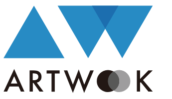

<p align="center">
  <a href="https://artwook.com">
    
  </a>
</p>


# ARTWOOK Contract Repository
This is AKC contract source code repository.

## AKC Contract 
```
./contracts/AKC.sol
```

## development
```
yarn install

npm run dev
```

## combine all files
```
npm run flat
```
All code will be in one file ```./artwookCoinContract.sol```.

## smart contract security audit report
[Audit Report](./AKC_smart_contract_security_audit_report.pdf)
